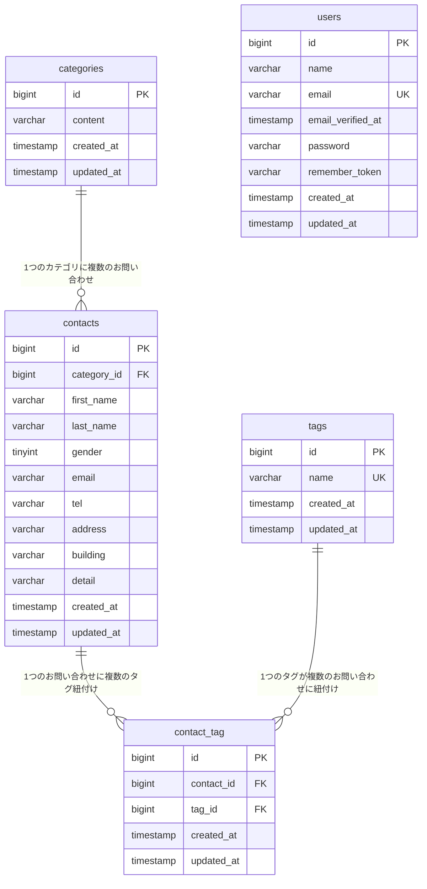

# COACHTECH お問い合わせフォーム

## 概要

CoachTech基礎学習ターム確認テスト課題として開発した、お問い合わせフォームアプリケーションです。

一般ユーザーが利用する公開のお問い合わせフォームと、管理者がログイン後に内容を確認・管理する管理画面で構成されています。バックエンドはTraditional Web構成（Blade + セッション認証）を採用しつつ、応用機能としてお問い合わせデータのCRUD操作が可能な認証不要の公開APIも実装しています。

### 実装した機能

**基本機能**
- お問い合わせフォーム（入力 → 確認 → 送信 → サンクスページ）
- 管理者登録・ログイン（Laravel Fortify）
- 管理画面（お問い合わせ一覧・検索・ページネーション・詳細・削除）
- タグ管理（追加・編集・削除）
- ログアウト

**応用機能**
- CSVエクスポート（検索条件付き、BOM付きUTF-8）
- 公開API（`/api/v1/contacts` の一覧・詳細取得・作成・更新・削除、認証不要）

## ER図



- `categories` 1 : N `contacts`（1つのカテゴリに複数のお問い合わせが属する）
- `contacts` N : M `tags`（中間テーブル `contact_tag` を介した多対多。`UNIQUE(contact_id, tag_id)` 制約あり）
- 外部キーはすべて `ON DELETE CASCADE`（親レコード削除時に関連レコードも自動削除）

## 使用技術

| 分類 | 技術 |
|---|---|
| 言語 | PHP 8.2 |
| フレームワーク | Laravel 10.x |
| データベース | MySQL 8.0 |
| Webサーバー | Nginx |
| フロントエンド | Blade, Vite, Tailwind CSS ^3.4.0, Alpine.js |
| 認証 | Laravel Fortify |
| 開発環境 | Docker, Laravel Sail, phpMyAdmin |
| テスト | PHPUnit（Laravel標準） |
| コード整形 | Laravel Pint |

## 環境構築手順

### 1. リポジトリのクローン

```bash
git clone <このリポジトリのURL>
cd contact-form-app
```

### 2. Sailの起動

```bash
./vendor/bin/sail up -d
```

初回起動時、Dockerイメージのビルドに数分かかります。

### 3. `.env`ファイルの設定

`.env.example` を `.env` にコピーし、以下がSailの設定と一致していることを確認してください。

```
DB_CONNECTION=mysql
DB_HOST=mysql
DB_PORT=3306
DB_DATABASE=laravel
DB_USERNAME=sail
DB_PASSWORD=password
```

### 4. アプリケーションキーの生成

```bash
sail artisan key:generate
```

### 5. パッケージのインストール

```bash
sail composer install
sail npm install
```

### 6. マイグレーション・シーディング

```bash
sail artisan migrate --seed
```

初期管理者アカウント（UserSeederで投入）:
- メールアドレス: `test@example.com`
- パスワード: `password`

### 7. フロントエンドのビルド

```bash
sail npm run dev
```

このコマンドは実行したままにしておく必要があります（別ターミナルでの起動を推奨）。

### 8. 動作確認

ブラウザで [http://localhost](http://localhost) にアクセスしてください。

## 開発環境URL

- お問い合わせフォーム: [http://localhost](http://localhost)
- 管理画面ログイン: [http://localhost/login](http://localhost/login)
- 管理画面: [http://localhost/admin](http://localhost/admin)（要ログイン）

## APIエンドポイント一覧

認証不要の公開APIです。

| メソッド | URI | 概要 |
|---|---|---|
| GET | `/api/v1/contacts` | お問い合わせ一覧取得（検索・ページネーション対応） |
| GET | `/api/v1/contacts/{contact}` | お問い合わせ詳細取得（カテゴリ・タグ含む） |
| POST | `/api/v1/contacts` | お問い合わせ新規作成 |
| PUT | `/api/v1/contacts/{contact}` | お問い合わせ更新 |
| DELETE | `/api/v1/contacts/{contact}` | お問い合わせ削除 |

### 一覧取得の検索パラメータ

| パラメータ | 型 | 説明 |
|---|---|---|
| `keyword` | string | 姓・名・メールの部分一致検索 |
| `gender` | integer | 性別フィルタ（1:男性, 2:女性, 3:その他） |
| `category_id` | integer | カテゴリID絞り込み |
| `date` | string | 作成日フィルタ（YYYY-MM-DD） |
| `page` | integer | ページ番号（デフォルト: 1） |
| `per_page` | integer | 1ページあたりの件数（デフォルト: 20、最大: 100） |

## テストの実行

```bash
sail artisan test
```

カバレッジ計測:

```bash
sail artisan test --coverage
```

## コード整形

```bash
sail bin pint
```

## 作成者

池田 駿汰
